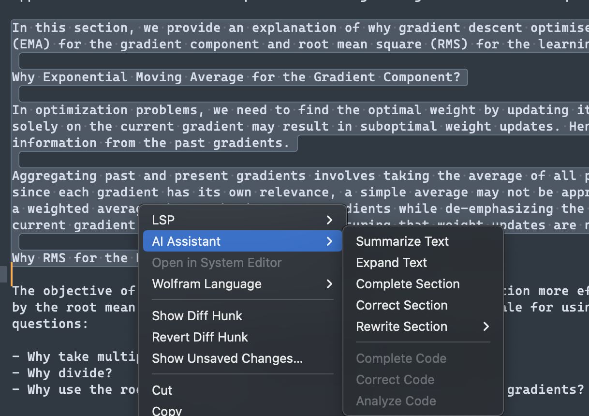

# Sublime Text OpenAIassist Plugin

## Abstract
This Sublime Text plugin allows you to automatically edit, modify, and alter selected text and code using the OpenAI API. When text is selected you can select the AI assistant to summarize, rewrite or expand the selected text. For code, you can ask it to fix or complete and analyze the code. See the screenshot with the context window below:

Click to see screens

---

## Requirements
- Sublime Text 3 or newer
- An OpenAI API key
- Internet connection

## Installation
Simply zip this folder and name it \"OpenAIassist.sublime-package\", then copy it to the ~/Library/ApplicationSupport/Sublime\ Text3/Installed Packages folder on a Mac or the appropriate folders on Linux or Windows. Alternatively, just use Package Control on search for this plugin.

## Usage
Select any text in Sublime Text, and Ctrl-click which opens the context menu. Look for the AI assistant tab and
select the proper tasks.

## Customization
The plugin can be customized by modifying the AI assistant file located in Settings > Package Settings. Various customizations can be made, such as changing the OpenAI model by updating the model key in the data dictionary to utilize a different OpenAI engine. Additionally, the maximum tokens can be adjusted by changing the max_tokens value in the data dictionary to limit or extend the AI-generated response length. Lastly, the prompt can be modified by updating the prompt key in the data dictionary to utilize a distinct prompt or instruction for the AI.

## Disclaimer
Please note that the OpenAI API has usage limits and costs. Use this plugin responsibly and ensure you understand the limitations and pricing associated with the OpenAI API. The plugin author is not responsible for any costs incurred or issues that may arise from using the OpenAI API.

## License
This project is licensed under the MIT License.
